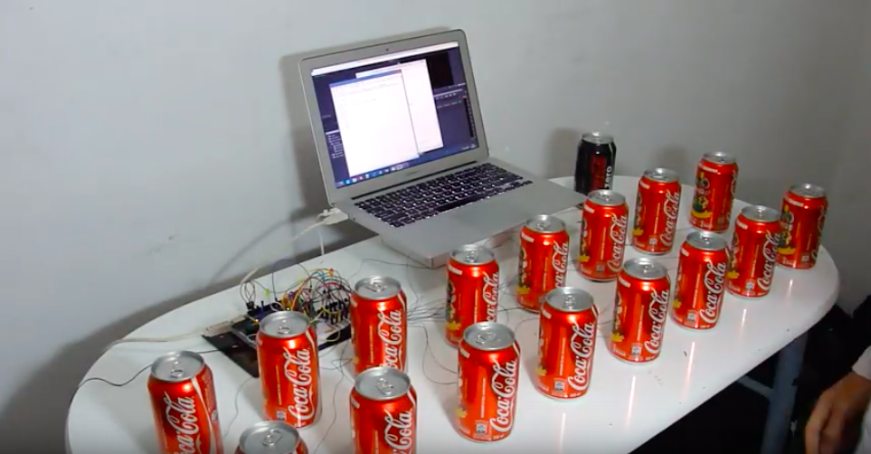

# Assessment 1: Replication project

*Fill out the following workbook with information relevant to your project.*

*Markdown reference:* [https://guides.github.com/features/mastering-markdown/](http://guides.github.com/features/mastering-markdown/)

## Replication project choice ##

Banana keyboard 

## Related projects ##
*Find about 6 related projects to the project you choose. A project might be related through  function, technology, materials, fabrication, concept, or code. 

### Related project 1 ###

Touch Board

https://www.bareconductive.com/make/introducing-the-touch-board/

This project is related to mine because firstly the board plays certain sounds depending on what is touch. My project and the touch board both have a similar function as they are both trigger by touch which then plays audio from speakers. Although the touch board has a different connection element as they use a electric Paint pen. 

### Related project 2 ###

Pringles drum kit

https://www.instructables.com/id/Pringle-Can-MIDI-Drums/

The pringles drum kit is related to mine with materials and function. The both banana's and pringles are materials that are household objects, the play a fun and interesting part in the project. This projects also plays sounds by touch circuit this is obviously the main function in the banana keyboard also. 

### Related project 3 ###

Coke piano 

https://www.youtube.com/watch?v=Ttm62RBdOuo

The coke piano is comparable to the banana keyboard as they are both clearly the same instrument with sound projecting from it. Again it has the same function and materials, as the coke cans are a unusual but exciting part of the project, this also reflects the banana keyboard. 

### Related project 4 ###

Responsive + conductive ink tapestry installation

https://www.designboom.com/technology/conductive-ink-responds-to-tactile-feedback-to-create-sound-12-06-2013/

### Related project 5 ###

Music playing wall 

https://www.youtube.com/watch?v=RG5Fi-eCLbc&feature=share

### Related project 6 ###

Hidden Stories 

https://redpaperheart.com/work/hiddenstories

## Reading reflections ##
*Reflective reading is an important part of actually making your reading worthwhile. Don't just read the words to understand what they say: read to see how the ideas in the text fit with and potentially change your existing knowledge and maybe even conceptual frameworks. We assume you can basically figure out what the readings mean, but the more important process is to understand how that changes what you think, particularly in the context of your project.*

*For each of the assigned readings, answer the questions below.*

### Reading: Don Norman, The Design of Everyday Things, Chapter 1 (The Psychopathology of Everyday Things) ###

*What I thought before: Describe something that you thought or believed before you read the source that was challenged by the reading.*

*What I learned: Describe what you now know or believe as a result of the reading. Don't just describe the reading: write about what changed in YOUR knowledge.*

*What I would like to know more about: Describe or write a question about something that you would be interested in knowing more about.*

*How this relates to the project I am working on: Describe the connection between the ideas in the reading and one of your current projects or how ideas in the reading could be used to improve your project.*

### Reading: Chapter 1 of Dan Saffer, Microinteractions: Designing with Details, Chapter 1 ###

*What I thought before: Describe something that you thought or believed before you read the source that was challenged by the reading.*

*What I learned: Describe what you now know or believe as a result of the reading. Don't just describe the reading: write about what changed in YOUR knowledge.*

*What I would like to know more about: Describe or write a question about something that you would be interested in knowing more about.*

*How this relates to the project I am working on: Describe the connection between the ideas in the reading and one of your current projects or how ideas in the reading could be used to improve your project.*

### Reading: Scott Sullivan, Prototyping Interactive Objects ###

*What I thought before: Describe something that you thought or believed before you read the source that was challenged by the reading.*

*What I learned: Describe what you now know or believe as a result of the reading. Don't just describe the reading: write about what changed in YOUR knowledge.*

*What I would like to know more about: Describe or write a question about something that you would be interested in knowing more about.*

*How this relates to the project I am working on: Describe the connection between the ideas in the reading and one of your current projects or how ideas in the reading could be used to improve your project.*

## Interaction flowchart ##

## Process documentation

The main source that helped me majorly with my project was youtube videos and other similar projects like the touch board. 

https://www.youtube.com/watch?v=Q_kbW2-qksw

1. This youtube video help me getting started with coding and basically wrapping my head around how it performs. Although this video doesn't seem very credential it still gave me an idea on how to put it together in the beginnning. 

https://www.youtube.com/watch?time_continue=9&v=GEpZrvbsO7o&feature=emb_title

2. This youtube video was found on the microbit website for the banana keyboard. This video gave me an in-depth understanding of the circuit and the more technical side of the project. Although the outcome and coding didn't represent what I was trying to achieve it had very similar function and circuit. 

https://www.youtube.com/watch?v=qtDZ3fYyUN0

3. This was an bit of an inspiration and understanding touch sensitive circuit. It also has a similar function and piano sounds to the banana keyboard. 

## Project outcome ##

### Project title ###
Banana Keyboard 

### Project description ###

The banana keyboard is a fun way to play with sound or music and learning the basics of tones and beats. The banana keyword can be altered with any conductive fruit for example; oranges, lime, lemon, grapfruit. The idea is of this keyboard is to explore sound with a touch trigger and amusing and uncommon objects. This project is for anyone that enjoys sound or music but especially the younger people that like an entertaining but educational project.  

### Showcase image ###

### Additional view ###

### Reflection ###

The main part of my project that I feel needed improvement was the presentation. The project didn't look as engaging as I expected. If I had more time it would've been presentated on a more appealing, decorated box instead of a shoe box. I also would've included a speaker instead of headphones, because when i was testing it with an aux cord and speaker it was louder and gave a better sound than the headphones. Although the speaker couldn't be included in the final project due to accessibility. 

My related projects gave me heaps of useful information and approaches as they taught my the techicinal side of touch sensitive projects such as mine. They helped me understand the touch circut and how projects can be altered but the main idea and function remains. It also gave me inspiration with how I could expand it and give it a more personal touch. 

I've always been interested in touch or movenment sensitive projects that I find all over my printerest, especially projects that involve music. Printerest was the main source that informed my thinking on this project, for example the Responsive + conductive ink tapestry installation that has sensors that react to the presence of a person outputting a sound. 

https://www.designboom.com/technology/conductive-ink-responds-to-tactile-feedback-to-create-sound-12-06-2013/

The project can be extented in many way to different conductive objects, the number of objects or the sound. The sounds don't have to be piano sound, it could be changed to words, number or different tones. The context of the project can changed in numerous ways depending on the objects and sound used. The banana keyboard could be used as an eductional project for smaller kids. For example to teach kids different fruits or even object, sound that comes out depends on the object you touch, so if a banana was touch the sound would be "banana". 
